### What is an image?

Formally, an digitalimage is represented as f(x, y) where x and y are spatial co-ordinates and each element in the matrix is the pixel intensity at position (x, y), or the amplitude, L.

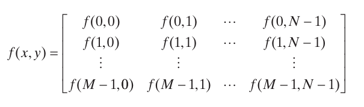

The world that we see with our eyes is an example of analog image, which is a continuous representations of visual information, like a wave form.
A digital image is a discrete approximation of this continuous image.

To do any sort of image processing we have to convert this continous stream to a digital image, and we use two techniques - sampling and quantization.

#### Sampling

- Sampling is the process of converting a continuous image into discrete points across the spatial cordinates. 
- The sampling rate (or resolution) determines how many samples are taken.


#### Qunatization

- Quantization is the process of converting continuous amplitude values to discrete digital values.
- Each sample is assigned to the nearest predetermined level.
- The number of quantization levels is determined by bit depth.

Example: With 8-bit quantization, we have 256 possible levels (2^8) for each color channel

The x and y spatial values have to be positive and the L is usually in powers of 2.

Therefore, the numbers of bits b, to store a digital image is  ( x . y . L )

#### Spatial Resolution

Spatial resolution can be stated in many ways like line pairs per unit distance, and dots (pixels) per unit distance. 

What is the resolution of an image 1024 x 1024?
We cant go there yet since, simply stating the number of pixels without context of physical dimensions doesn't give us complete information about the image's actual resolution.

To understand this, consider -
PPI = Number of pixels / Physical dimension

```
A 1024×1024 image displayed on:
    - A small smartphone screen (2×2 inches) = 512 PPI (very sharp)
    - A large monitor (8×8 inches) = 128 PPI (visible pixels)
    - A billboard (200×200 inches) = 5.12 PPI (very pixelated)
```

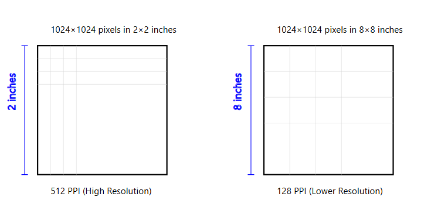


#### Intensity Resolution

Intensity resolution refers to the number of different brightness or gray levels that can be represented in an image.
It's determined by the number of bits used to represent each pixel.

1-bit: 2¹ = 2 levels (black and white only)
2-bit: 2² = 4 levels of gray
3-bit: 2³ = 8 levels of gray
8-bit: 2⁸ = 256 levels of gray (standard grayscale)
24-bit: 8 bits each for R,G,B = 16.7 million colors

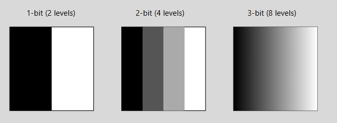

#### Image Interpolation ( all 3 implemented in algorithm section)

Interpolation is the process of using known data to estimate values at unknown locations.

1. The Nearest Neighbor Interpolation

Suppose that an image of size 500 x 500 pixels has to be enlarged 1.5 times to 750 x 750 pixels.

A simple way to visualize zooming is to create an imaginary 750 x 750 pixels. 
A grid with the same pixel spacing as the original image, then shrink it so that it exactly overlays the original image. 
Obviously, the pixel spacing in the shrunken 750 750 grid will be less than the pixel spacing in the original image.
To assign an intensity value to any point in the overlay, we look for its closest pixel in the underlying original image and assign the intensity of that pixel to the new pixel in the 750 750 grid.
When intensities have been assigned to all the points in the overlay grid, we expand it back to the specified size to obtain the resized image.

2. bilinear interpolation

The problem with nearest neighbor is that it produces blobs and pixels get affected, bilinear proposes to use 4 neighboring pixels to estimate the pixel values instead of one.

v(x, y) = ax + by + cxy + d

3. bicubic interpolation

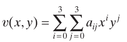

use 16 points

3 > 2 > 1 in terms of quality but tradesoff between computation.


### Using the image addition for noise reduction.

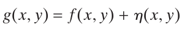

Consider g(x, y) as a corrupted image where n noise is added to f(x, y).

You can reduce the noise in the image but adding slightly noised images if -1
1. the pixels and noise is uncorrelated.
2. The average value of the noise at any pixel is zero.

If the constraints follow, you can simply average K less noisy images and approximate this.

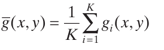

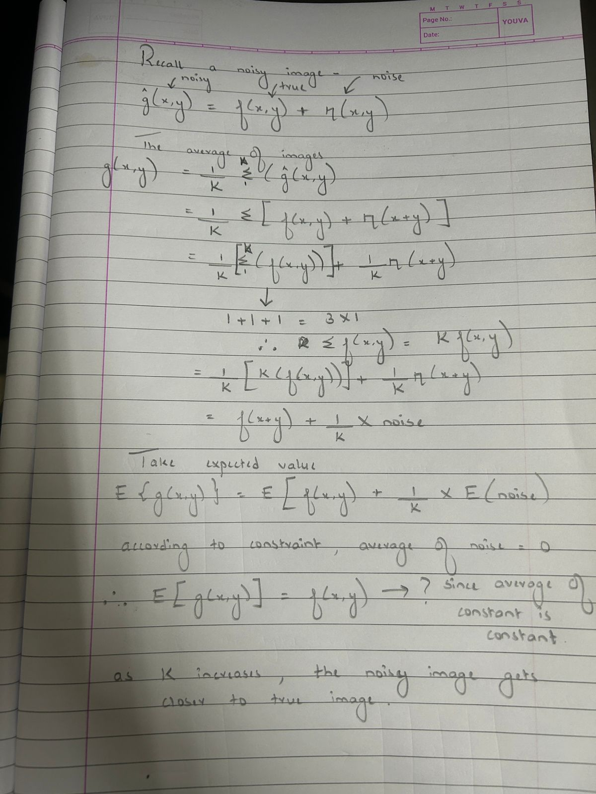


#### Image transformation using logical operators

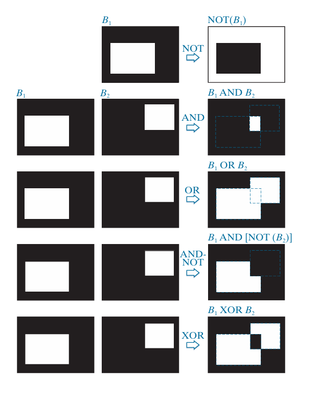


### Spatial Operations

Operations performed directly on the pixels of an image,

1. single-pixel operations

Altering the intensity of its pixels individually using a transformation function, T

s = T(z)

2. neighborhood operations

The value of a pixel is determined by a specified operation on the neighborhood of pixels in the input image.

3. geometric spatial transformations

These transformations modify the spatial arrangement of pixels in an image.

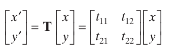

Affine transformations include scaling, translation, rotation, and shearing. The key characteristic of an affine transformation in 2-D is that it preserves points, straight lines, and planes.

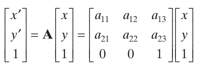

This transformation can scale, rotate, translate, or sheer an image, depending on the values chosen for the elements of matrix A.

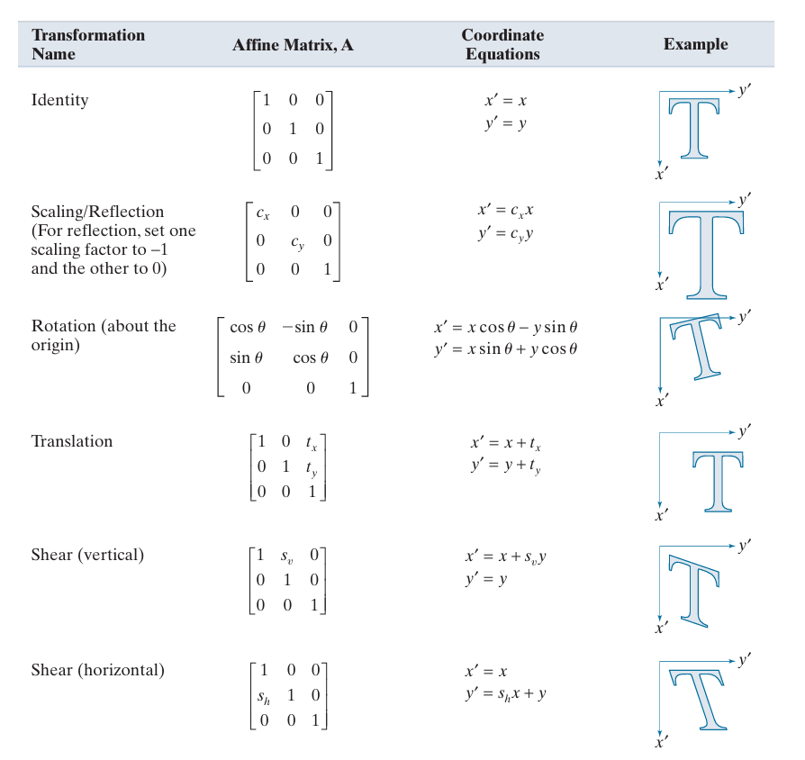

