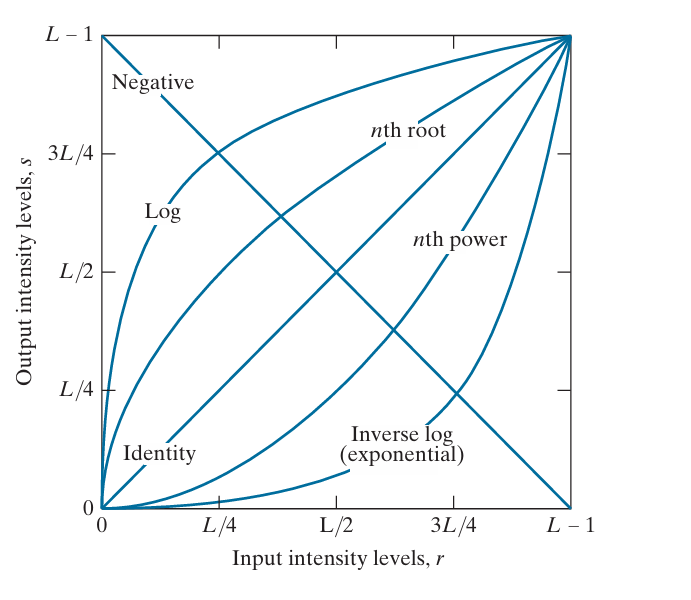
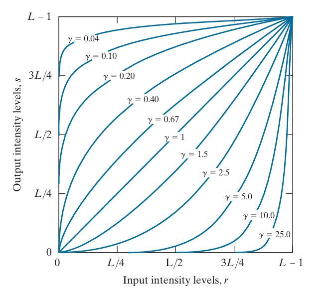

### Intensity transformation techniques

These techniques operate directly on the pixels of an image.

1. IMAGE NEGATIVES 

The negative of an image with intensity levels in the range [0, L − 1]  is obtained by using the negative transformation function.

0 = black
L - 1 = white
L is the total number of intensity levels (e.g., 256 for an 8-bit image)

```
s = L - 1 - r
```

r = original pixel intensity value

1. a dark pixel (r = 0) becomes white 

s = L - 1
  = white

2. a white pixel(r = L - 1) becomes dark.

s = 0
  = dark

This type of processing is used, for example, in enhancing white or gray detail embedded in dark regions of an image, especially when the black areas are dominant in size.


2. LOG TRANSFORMATION

The logarithmic transformation is a technique to enhance the visual perception of images by modifying pixel intensity values based on a logarithmic function.

```
s = c . log(1 + r)
```

c = A scaling constant to control the brightness of the output.

Key Characteristics of Log Transformation

1. The log function maps a narrow range of low input intensity values into a wider range of output values. This increases the visibility of details in the darker parts of the image, enhancing features that are otherwise hard to perceive.

2. Conversely, higher input intensity values are compressed into a narrower range in the output. This prevents bright areas from dominating the image and reduces the risk of saturating the display.

For example, note how input levels in the range [0, L/4] map to output levels to the range [0, 3L/4]



3. GAMMA TRANSFORMATIONS

s = (c . r)γ

c: Positive scaling constant to control brightness.
γ: Positive constant or the gamma exponent.



( 𝛾 < 1)
- Expands the range of dark input values into a wider range of output values.
- Compresses the range of bright input values.
- Useful for enhancing details in dark regions of an image.


( γ > 1)
- Compresses the range of dark input values.
- Expands the range of bright input values.
- Useful for enhancing details in bright regions of an image.

Both of them have an inverse effect.

