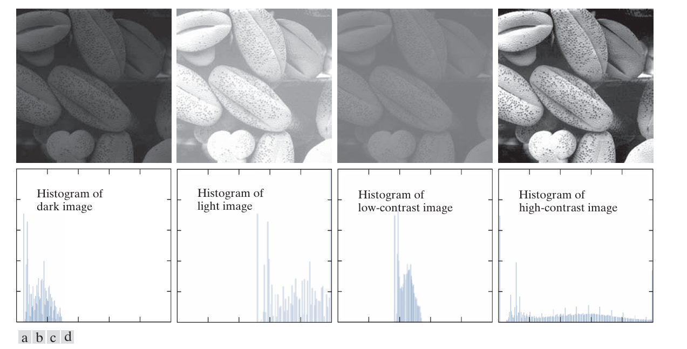

### Intensity transformation techniques

These techniques operate directly on the pixels of an image.

1. IMAGE NEGATIVES 

The negative of an image with intensity levels in the range [0, L − 1]  is obtained by using the negative transformation function.

0 = black
L - 1 = white
L is the total number of intensity levels (e.g., 256 for an 8-bit image)

```
s = L - 1 - r
```

r = original pixel intensity value

1. a dark pixel (r = 0) becomes white 

s = L - 1
  = white

2. a white pixel(r = L - 1) becomes dark.

s = 0
  = dark

This type of processing is used, for example, in enhancing white or gray detail embedded in dark regions of an image, especially when the black areas are dominant in size.


2. LOG TRANSFORMATION

The logarithmic transformation is a technique to enhance the visual perception of images by modifying pixel intensity values based on a logarithmic function.

```
s = c . log(1 + r)
```

c = A scaling constant to control the brightness of the output.

Key Characteristics of Log Transformation

1. The log function maps a narrow range of low input intensity values into a wider range of output values. This increases the visibility of details in the darker parts of the image, enhancing features that are otherwise hard to perceive.

2. Conversely, higher input intensity values are compressed into a narrower range in the output. This prevents bright areas from dominating the image and reduces the risk of saturating the display.

For example, note how input levels in the range [0, L/4] map to output levels to the range [0, 3L/4]


3. GAMMA TRANSFORMATIONS

s = (c . r)γ

c: Positive scaling constant to control brightness.
γ: Positive constant or the gamma exponent.


( 𝛾 < 1)
- Expands the range of dark input values into a wider range of output values.
- Compresses the range of bright input values.
- Useful for enhancing details in dark regions of an image.


( γ > 1)
- Compresses the range of dark input values.
- Expands the range of bright input values.
- Useful for enhancing details in bright regions of an image.

Both of them have an inverse effect.


### Piecewise Linear Transformation

A piecewise linear transformation is a type of intensity transformation in image processing where the mapping of input intensity values to output values is defined by multiple linear segments. Instead of a single mathematical function, the transformation is broken into "pieces," with each piece being a linear equation that applies to a specific range of input intensity values.


1. Contrast Stretching

Low-contrast images can result from poor illumination, lack of dynamic range in the imaging sensor, or even the wrong setting of a lens aperture during image acquisition. Contrast stretching expands the range of intensity levels in an image so that it spans the ideal full intensity range of the recording medium or display device.

The goal is to map the intensity values of the input image *r* to *s* such that the range of intensities in the output image spans the ideal range [0 , L−1], where 
L−1 is the maximum intensity of the display.

the transformation s = T(r) is defined using two control points (r1, s1) and (r2, s2) and these determine shape of the transformation curve.  The curve can stretch, compress, or threshold intensity values depending on the placement of these points.

- if r1 = s1 and r2 = s2, it becomes a linear transformation.
- if r1 = r2 and s2 = L - 1, the transformation produces a binary image by mapping intensities below r1 to 0 and above r1 to L − 1.

Steps to perform this
1. Find the minimum(rmin) and max(rmax) intensity values in the image.
2. set the control points
(r1, s1) = (rmin, 0) (Maps the minimum intensity to the lowest output value)
(r2, s2) = (rmax, L - 1) (Maps the maximum intensity to the highest output value)
3. Apply this transformation.


[notebook](../algorithms/03-contrastive-strecthing.ipynb)


2. Intensity Level Slicing

Intensity-level slicing is a technique used to highlight a specific range of intensities in an image.

#### Histogram Processing 

A histogram is a graphical representation of the intensity distribution of an image. It shows the number of pixels for each intensity level.



Histogram Equalization

Histogram equalization transforms the intensity values of an image such that the output image has a uniform distribution of intensities. This enhances the contrast by spreading out the intensity values more evenly across the available range.

```
s = T(r)
```
0 <= r <= L - 1

s - transformed pixels
r - original pixels
T - transformation function

To perform the transformation, T(r) must satisfy -
1. Monotonicity: T(r) must be non-decreasing so that intensities do not reverse.
2. Range Preservation: T(r) maps the range [0, L − 1] in to the same range in 𝑠.

The T(r) is given by the cumulative distributive function .


The integral represents the area under the PDF curve up to r. Multiplying by L − 1 ensures that the output intensity s spans the range [0, L − 1].


For discrete values, the function becomes -


#### Spatial filtering

The name filter is borrowed from frequency domain processing where “filtering” refers to passing, modifying, or rejecting specified fre
quency components of an image.

A filter that passes low frequencies is called a lowpass filter.

Spatial filtering is a process used in image processing to modify an image based on the spatial relationship between pixels. It works by replacing the value of each pixel with a new value computed using a specific function applied to the pixel and its neighboring pixels. 

Linear Spatial filtering

A linear spatial filter performs a sum-of-products operation between an image f and a filter kernel, w. The kernel is an array whose size defines the neighborhood of opera
tion, and whose coefficients determine the nature of the filter. Basically you have a kernel sliding through the image.

